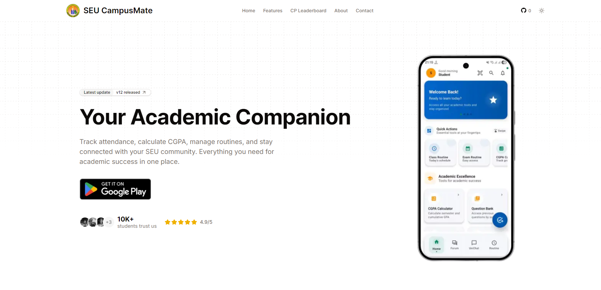

# SEU CampusMate Web



Web companion for [Southeast University](https://seu.edu.bd) students. Academic tools, campus info, and student resources in one place.

## Features

### Academic Tools

| Tool | Description |
|------|-------------|
| **CGPA Calculator** | Calculate cumulative GPA, track semester performance, and plan your academic journey |
| **Attendance Calculator** | Track class attendance and ensure you meet the 75% requirement |
| **Exam Routine Finder** | Search exam schedules by course code; get dates, times, and faculty info |
| **Tuition Calculator** | Estimate semester fees, payment schedules, and financial obligations |
| **Cover Page Generator** | Create assignment cover pages with customizable fields and PDF export |
| **Academic Calendar** | View university events, deadlines, and semester schedules |
| **Assessment Tracking** | Organize assignments, quizzes, and examination schedules |
| **Course Catalog** | Browse courses with prerequisites, credits, and topics |
| **Curriculum** | CSE curriculum with semester-wise breakdown and prerequisites |

### Campus & Community

| Feature | Description |
|---------|-------------|
| **Bus Routes** | Interactive map of SEU bus routes and stops |
| **Blood Donors** | Find blood donors within the SEU community |
| **CP Leaderboard** | Codeforces leaderboard for SEU competitive programmers |
| **Portals & Links** | Quick access to university portals and resources |
| **Faculty Info** | Faculty contact details and office hours |
| **Campus Info** | Campus facilities, locations, and services |
| **Important Contacts** | Department contacts and emergency numbers |
| **Question Bank** | Course question bank (mobile app exclusive) |

## Prerequisites

- Node.js 18+
- npm, yarn, pnpm, or bun

## Installation

Clone the repo and install dependencies:

```bash
git clone <repository-url>
cd seucampusmate-web
npm install
```

## Environment Variables

Copy `.env.example` to `.env.local` and fill in the values:

| Variable | Description |
|----------|-------------|
| `UPSTASH_REDIS_REST_URL` | Upstash Redis REST API URL |
| `UPSTASH_REDIS_REST_TOKEN` | Upstash Redis REST API token |
| `GOOGLE_SHEETS_CSV_URL` | Google Sheets CSV export URL |
| `EXAMS_CSV_URL` | Exams data CSV URL |
| `NEXT_PUBLIC_ACADEMIC_CALENDAR_URL` | Academic calendar JSON/data URL |
| `NEXT_PUBLIC_BLOOD_DONORS_API_URL` | Blood donors API endpoint |
| `NEXT_PUBLIC_MAP_STYLE_DARK` | MapLibre dark style URL |
| `NEXT_PUBLIC_MAP_STYLE_LIGHT` | MapLibre light style URL |
| `CP_USERNAMES_API_URL` | Codeforces usernames API |
| `CODEFORCES_API_BASE` | Codeforces API base URL |

Some features work without all variables; academic calendar, blood donors, and CP leaderboard rely on their respective APIs.

## Scripts

| Command | Description |
|---------|-------------|
| `npm run dev` | Start development server at [localhost:3000](http://localhost:3000) |
| `npm run build` | Build for production |
| `npm run start` | Start production server |
| `npm run lint` | Run ESLint |

## Tech Stack

- **Framework:** Next.js 16 (App Router)
- **UI:** React 19, TypeScript, Tailwind CSS 4, shadcn/ui, Radix UI
- **Maps:** MapLibre GL
- **PDF:** jsPDF, pdf-lib, html2canvas
- **Data:** Axios, CSV parse, date-fns
- **Caching:** Upstash Redis (for CP leaderboard and exams)
- **Theming:** next-themes (light/dark mode)

## Project Structure

```
app/
├── api/                 # API routes
│   ├── cp/              # CP leaderboard (users, refresh)
│   ├── exams/           # Exam data (course, refresh)
│   └── mobile/          # Mobile app APIs (health, users, usernames)
├── bus/                 # Bus routes map
├── course-catalog/      # Course catalog
├── cp/                  # CP leaderboard page
├── curriculum/          # CSE curriculum
├── tools/               # Academic tools
│   ├── academic-calendar/
│   ├── assessment-tracking/
│   ├── attendance-calculator/
│   ├── blood-donors/
│   ├── campus-info/
│   ├── cgpa-calculator/
│   ├── coverpage/
│   ├── exam-routine/
│   ├── faculty-info/
│   ├── important-contacts/
│   ├── portals-links/
│   ├── question-bank/
│   └── tuition-calculator/
components/
├── blood-donation/      # Blood donor components
├── cp/                  # CP leaderboard table
├── course-catalog/      # Course catalog components
├── exam-routine/        # Exam search and results
├── feature/             # Homepage feature grid
├── marks-tracker/       # Assessment tracking
├── navbar/              # Header, logo, mobile nav
└── ui/                  # shadcn/ui components
lib/
├── cp/                  # Codeforces scraping, cache, ranks
├── data/                # Data fetching utilities
├── seo/                 # Metadata, page registry, structured data
└── *.ts                 # Shared utilities
```

## Links

- **Live site:** [campusmate.app](https://campusmate.app)
- **CodeShare:** [code.campusmate.app](https://code.campusmate.app)
- **Mobile app:** [Google Play](https://play.google.com/store/apps/details?id=com.apppulse.seu)

## Contributing

Want to contribute? See [CONTRIBUTING.md](CONTRIBUTING.md) for guidelines.
